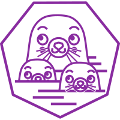

<!--
**duskstar9623/duskstar9623** is a ✨ _special_ ✨ repository because its `README.md` (this file) appears on your GitHub profile.

Here are some ideas to get you started:

- 🔭 I’m currently working on ...
- 🌱 I’m currently learning ...
- 👯 I’m looking to collaborate on ...
- 🤔 I’m looking for help with ...
- 💬 Ask me about ...
- 📫 How to reach me: ...
- 😄 Pronouns: ...
- ⚡ Fun fact: ...
-->

<!-- visitors -->

<!-- visitors -->

 

<!-- Typing Animation -->

<!-- Typing Animation -->

<!-- Brief Introduction -->

Hi, this is Duskstar, a Front-end Developer & Tech Meditator & Digital Artisan.

<!-- Brief Introduction -->

<!-- Social Link -->
#### 🔍 You can also find me on:

&nbsp; 

&nbsp; &nbsp; 

<!-- Social Link -->

<!-- Blog -->
#### 📓 My Recent Blogs:

<!-- BLOG-POST-LIST:START -->
- [从 HTML 到屏幕像素：一次性讲清浏览器渲染流程](https://juejin.cn/post/7536182394174734370)
- [神奇的前端“隐写术”：零宽字符](https://juejin.cn/post/7533150440818671654)
- [这次一定要讲清 ASCII &amp; Unicode！！！](https://juejin.cn/post/7533169614207254555)
- [聊聊 JavaScript 的 ASI 机制](https://juejin.cn/post/7533044069939462154)
- [【Event Loop】浏览器与 Node.js 事件循环详解](https://juejin.cn/post/7326803868326592539)
<!-- BLOG-POST-LIST:END -->
<!-- Blog -->

<!-- Languages and Tools -->
#### 👨‍💻 Languages & Tools & Abilities:

    <code></code>
    <code></code>
    <code></code>
    <code></code>
    <code></code>
    <code></code>
    <code></code>
    <code></code>    
    <code></code>
    <code></code>
    <code></code>
    <code></code>
    <code></code>    
    <code></code>

    <code></code>
    <code></code>
    <code></code>
    <code></code>
    <code></code>
    <code></code>
    <code></code>
    <code></code>    
    <code></code>
    <code></code>
    <code></code>
    <code></code>
    <code></code> 

<!-- Languages and Tools -->

<!-- Github Stats -->
#### 📊 Github Stats

|  |  |
| ------------- | ------------- |
<!-- Github Stats -->
